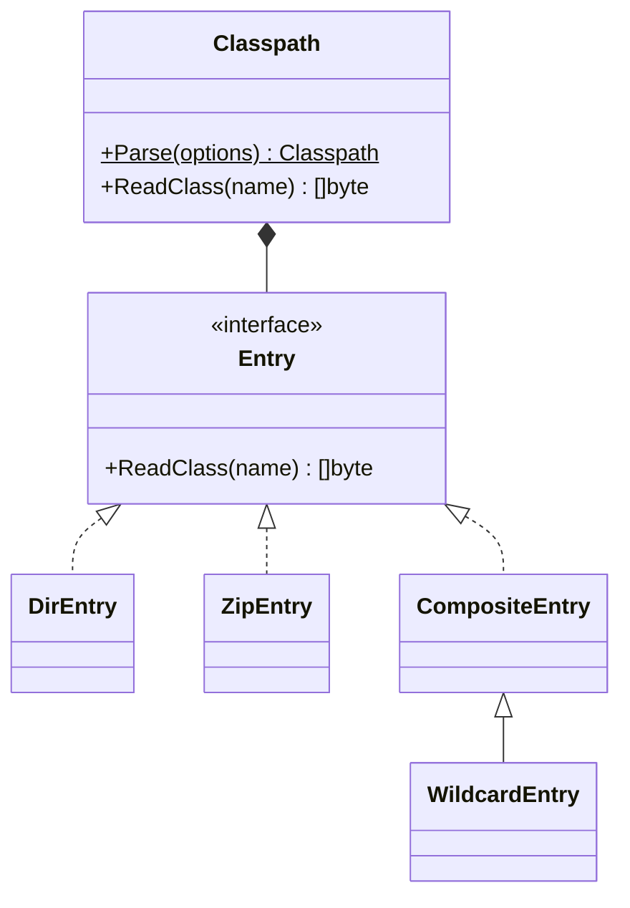
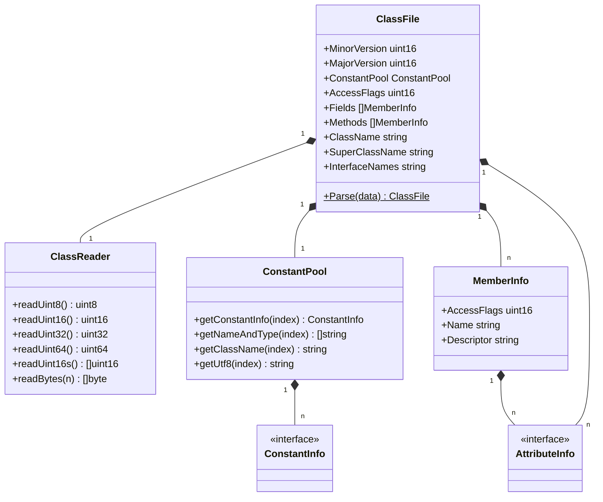
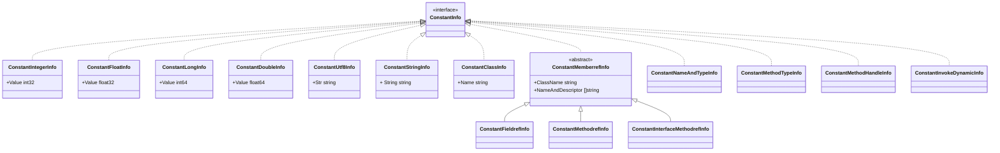

### Classpath


```mermaid
classDiagram
  class Classpath {
    +Parse(options)$ Classpath
    +ReadClass(name) []byte
  }
  Classpath *-- Entry

  class Entry {
    +ReadClass(name) []byte
  }
  <<interface>> Entry

  class DirEntry
  Entry <|.. DirEntry

  class ZipEntry
  Entry <|.. ZipEntry

  class CompositeEntry
  Entry <|.. CompositeEntry

  class WildcardEntry
  CompositeEntry <|-- WildcardEntry
```

### Classfile


```mermaid
classDiagram

  class ClassFile {
    +MinorVersion uint16
    +MajorVersion uint16
    +ConstantPool ConstantPool
    +AccessFlags uint16
    +Fields []MemberInfo
    +Methods []MemberInfo
    +ClassName string
    +SuperClassName string
    +InterfaceNames string
    +Parse(data)$ ClassFile
  }

  class ClassReader {
    +readUint8() uint8
    +readUint16() uint16
    +readUint32() uint32
    +readUint64() uint64
    +readUint16s() []uint16
    +readBytes(n) []byte
  }
  ClassFile "1" *-- "1" ClassReader

  class ConstantInfo
  <<interface>> ConstantInfo

  class ConstantPool {
    +getConstantInfo(index) ConstantInfo
    +getNameAndType(index) []string
    +getClassName(index) string
    +getUtf8(index) string
  }
  ClassFile "1" *-- "1" ConstantPool
  ConstantPool "1" *-- "n" ConstantInfo

  class MemberInfo {
    +AccessFlags uint16
    +Name string
    +Descriptor string
  }
  ClassFile "1" *-- "n" MemberInfo
  MemberInfo "1" *-- "n" AttributeInfo

  class AttributeInfo
  <<interface>>AttributeInfo
  ClassFile "1" *-- "n" AttributeInfo
```

#### ConstantInfo


```mermaid
classDiagram
  class ConstantInfo
  <<interface>> ConstantInfo

  class ConstantIntegerInfo {
    +Value int32
  }
  ConstantInfo <|.. ConstantIntegerInfo

  class ConstantFloatInfo {
    +Value float32
  }
  ConstantInfo <|.. ConstantFloatInfo

  class ConstantLongInfo {
    +Value int64
  }
  ConstantInfo <|.. ConstantLongInfo

  class ConstantDoubleInfo {
    +Value float64
  }
  ConstantInfo <|.. ConstantDoubleInfo

  class ConstantUtf8Info {
    +Str string
  }
  ConstantInfo <|.. ConstantUtf8Info

  class ConstantStringInfo {
    + String string
  }
  ConstantInfo <|.. ConstantStringInfo

  class ConstantClassInfo {
    +Name string
  }
  ConstantInfo <|.. ConstantClassInfo

  class ConstantMemberrefInfo {
    +ClassName string
    +NameAndDescriptor []string
  }
  <<abstract>>ConstantMemberrefInfo
  ConstantInfo <|.. ConstantMemberrefInfo

  class ConstantFieldrefInfo
  ConstantMemberrefInfo <|-- ConstantFieldrefInfo

  class ConstantMethodrefInfo
  ConstantMemberrefInfo <|-- ConstantMethodrefInfo

  class ConstantInterfaceMethodrefInfo
  ConstantMemberrefInfo <|-- ConstantInterfaceMethodrefInfo

  class ConstantNameAndTypeInfo
  ConstantInfo <|.. ConstantNameAndTypeInfo

  class ConstantMethodTypeInfo
  ConstantInfo <|.. ConstantMethodTypeInfo

  class ConstantMethodHandleInfo
  ConstantInfo <|.. ConstantMethodHandleInfo

  class ConstantInvokeDynamicInfo
  ConstantInfo <|.. ConstantInvokeDynamicInfo
```

#### AttributeInfo


```mermaid
classDiagram
  class AttributeInfo
  <<interface>>AttributeInfo

  class CodeAttribute {
    +MaxStack uint
    +MaxLocals uint
    +Code []byte
    +ExceptionTable []ExceptionTableEntry
  }
  AttributeInfo <|.. CodeAttribute
  CodeAttribute "1" *-- "n" ExceptionTableEntry

  class ExceptionTableEntry {
    +StartPc uint16
    +EndPc uint16
    +HandlerPc uint16
    +CatchType uint16
  }

  class ConstantValueAttribute {
    +ConstantValueIndex uint16
  }
  AttributeInfo <|.. ConstantValueAttribute

  class MarkerAttribute
  <<abstract>> MarkerAttribute
  AttributeInfo <|.. MarkerAttribute

  class DeprecatedAttribute
  MarkerAttribute <|-- DeprecatedAttribute

  class ExceptionsAttribute {
    +ExceptionIndexTable []uint16
  }
  AttributeInfo <|.. ExceptionsAttribute

  class LineNumberTableAttribute {
    +GetLineNumber(pc) int
  }
  AttributeInfo <|.. LineNumberTableAttribute
  LineNumberTableAttribute "1" *-- "n" LineNumberTableEntry

  class LocalVariableTableAttribute
  AttributeInfo <|.. LocalVariableTableAttribute
  LocalVariableTableAttribute "1" *-- "n" LocalVariableTableEntry

  class SourceFileAttribute {
    +FileName string
  }
  AttributeInfo <|.. SourceFileAttribute

  class SyntheticAttribute
  MarkerAttribute <|-- SyntheticAttribute

  class UnparsedAttributeAttribute {
    +Info []byte
  }
  AttributeInfo <|.. UnparsedAttributeAttribute

  class BootstrapMethodsAttribute
  AttributeInfo <|.. BootstrapMethodsAttribute

  class EnclosingMethodAttribute {
    +ClassName string
    +MethodNameAndDescriptor []string
  }
  AttributeInfo <|.. EnclosingMethodAttribute

  class InnerClassesAttribute
  AttributeInfo <|.. InnerClassesAttribute

  class LocalVariableTypeTableAttribute
  AttributeInfo <|.. LocalVariableTypeTableAttribute
  LocalVariableTypeTableAttribute "1" *-- "n" LocalVariableTypeTableEntry

  class SignatureAttribute {
    +Signature string
  }
  AttributeInfo <|.. SignatureAttribute
```

### Runtime

```mermaid
```
