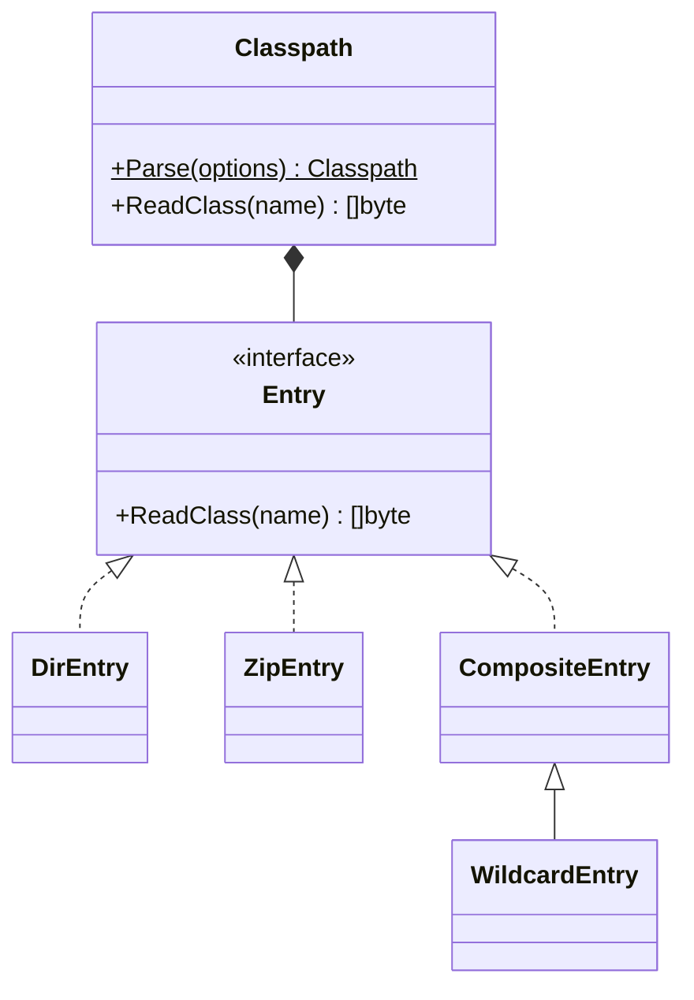
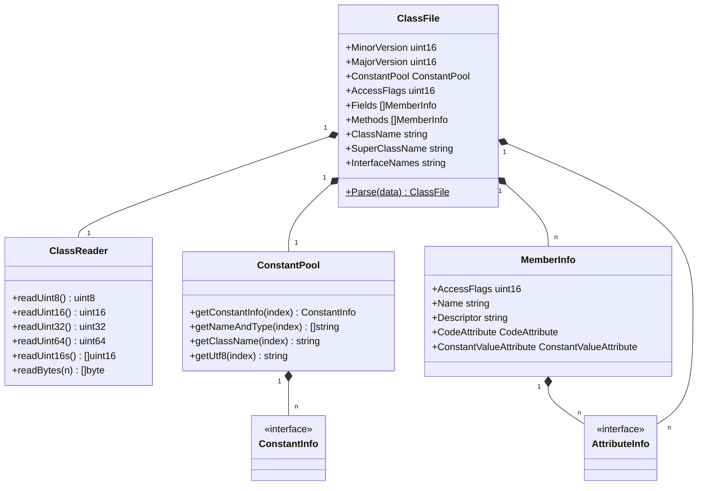
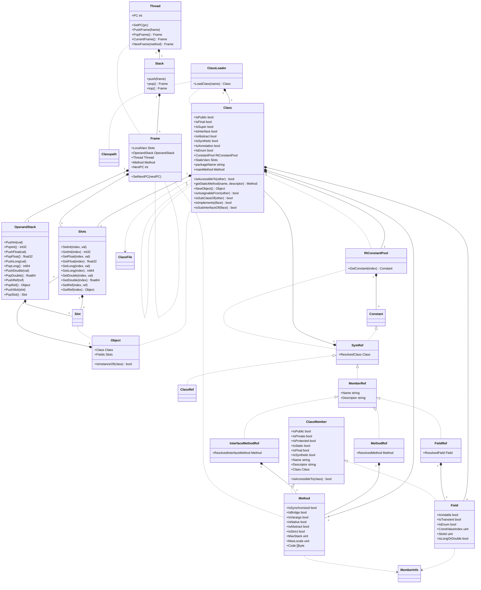

### Classpath

```mermaid
classDiagram
  class Classpath {
    +Parse(options)$ Classpath
    +ReadClass(name) []byte
  }
  Classpath *-- Entry

  class Entry {
    <<interface>>
    +ReadClass(name) []byte
  }

  class DirEntry
  Entry <|.. DirEntry

  class ZipEntry
  Entry <|.. ZipEntry

  class CompositeEntry
  Entry <|.. CompositeEntry

  class WildcardEntry
  CompositeEntry <|-- WildcardEntry
```

### Classfile

```mermaid
classDiagram
  class ClassFile {
    +MinorVersion uint16
    +MajorVersion uint16
    +ConstantPool ConstantPool
    +AccessFlags uint16
    +Fields []MemberInfo
    +Methods []MemberInfo
    +ClassName string
    +SuperClassName string
    +InterfaceNames string
    +Parse(data)$ ClassFile
  }

  class ClassReader {
    +readUint8() uint8
    +readUint16() uint16
    +readUint32() uint32
    +readUint64() uint64
    +readUint16s() []uint16
    +readBytes(n) []byte
  }
  ClassFile "1" *-- "1" ClassReader

  class ConstantInfo
  <<interface>> ConstantInfo

  class ConstantPool {
    +getConstantInfo(index) ConstantInfo
    +getNameAndType(index) []string
    +getClassName(index) string
    +getUtf8(index) string
  }
  ClassFile "1" *-- "1" ConstantPool
  ConstantPool "1" *-- "n" ConstantInfo

  class MemberInfo {
    +AccessFlags uint16
    +Name string
    +Descriptor string
    +CodeAttribute CodeAttribute
    +ConstantValueAttribute ConstantValueAttribute
  }
  ClassFile "1" *-- "n" MemberInfo
  MemberInfo "1" *-- "n" AttributeInfo

  class AttributeInfo
  <<interface>>AttributeInfo
  ClassFile "1" *-- "n" AttributeInfo
```

### Runtime

```mermaid
classDiagram
  class ClassLoader {
    +LoadClass(name) Class
  }
  ClassLoader .. Classpath
  ClassLoader "1" *-- "n" Class

  class RtConstantPool {
    +GetConstant(index) Constant
  }
  RtConstantPool "1" *-- "n" Constant
  RtConstantPool .. Class

  class Class {
    +IsPublic bool
    +IsFinal bool
    +IsSuper bool
    +IsInterface bool
    +IsAbstract bool
    +IsSynthetic bool
    +IsAnnotation bool
    +IsEnum bool
    +ConstantPool RtConstantPool
    +StaticVars Slots
    +isAccessibleTo(other) bool
    +packageName string
    +mainMethod Method
    +getStaticMethod(name, descriptor) Method
    +NewObject() Object
    +isAssignableFrom(other) bool
    +isSubClassOf(other) bool
    +isImplements(iface) bool
    +isSubInterfaceOf(iface) bool
  }
  Class "1" *-- "1" RtConstantPool
  Class "1" *-- "n" Field
  Class "1" *-- "n" Method
  Class .. ClassLoader
  Class "1" .. "n" Class
  Class "1" *-- "1" Slots
  Class .. Object
  Class ..> ClassFile

  Constant <|.. SymRef

  class SymRef {
    +ResolvedClass Class
  }
  SymRef <|.. ClassRef
  SymRef "1" *-- "1" Class
  SymRef .. RtConstantPool

  class MemberRef {
    +Name string
    +Descriptor string
  }
  SymRef <|.. MemberRef

  class FieldRef {
    +ResolvedField Field
  }
  MemberRef <|.. FieldRef
  FieldRef "1" *-- "1" Field

  class MethodRef {
    +ResolvedMethod Method
  }
  MemberRef <|.. MethodRef
  MethodRef "1" *-- "1" Method

  class InterfaceMethodRef {
    +ResolvedInterfaceMethod Method
  }
  MemberRef <|.. InterfaceMethodRef
  InterfaceMethodRef "1" *-- "1" Method

  class ClassMember {
    +IsPublic bool
    +IsPrivate bool
    +IsProtected bool
    +IsStatic bool
    +IsFinal bool
    +IsSynthetic bool
    +Name string
    +Descriptor string
    +Class Class
    +isAccessibleTo(class) bool
  }

  class Field {
    +IsVolatile bool
    +IsTransient bool
    +IsEnum bool
    +ConstValueIndex uint
    +SlotId uint
    +isLongOrDouble bool
  }
  ClassMember <|.. Field
  Field ..> MemberInfo

  class Method {
    +IsSynchronized bool
    +IsBridge bool
    +IsVarargs bool
    +IsNative bool
    +IsAbstract bool
    +IsStrict bool
    +MaxStack uint
    +MaxLocals uint
    +Code []byte
  }
  ClassMember <|.. Method
  Method ..> MemberInfo

  class Thread {
    +PC int
    +SetPC(pc)
    +PushFrame(frame)
    +PopFrame() Frame
    +CurrentFrame() Frame
    +NewFrame(method) Frame
  }
  Thread "1" *-- "1" Stack

  class Stack {
    +push(frame)
    +pop() Frame
    +top() Frame
  }
  Stack "1" *-- "n" Frame

  class Frame {
    +LocalVars Slots
    +OperandStack OperandStack
    +Thread Thread
    +Method Method
    +NextPC int
    +SetNextPC(nextPC)
  }
  Frame .. Frame
  Frame .. Thread
  Frame .. Method

  class Slots {
    +SetInt(index, val)
    +GetInt(index) int32
    +SetFloat(index, val)
    +GetFloat(index) float32
    +SetLong(index, val)
    +GetLong(index) int64
    +SetDouble(index, val)
    +GetDouble(index) float64
    +SetRef(index, ref)
    +GetRef(index) Object
  }
  Frame "1" *-- "1" Slots
  Slots "1" *-- "n" Slot

  class OperandStack {
    +PushInt(val)
    +PopInt() int32
    +PushFloat(val)
    +PopFloat() float32
    +PushLong(val)
    +PopLong() int64
    +PushDouble(val)
    +PopDouble() float64
    +PushRef(ref)
    +PopRef() Object
    +PushSlot(slot)
    +PopSlot() Slot
  }
  Frame "1" *-- "1" OperandStack
  OperandStack "1" *-- "n" Slot

  class Slot {
  }
  Slot .. Object

  class Object {
    +Class Class
    +Fields Slots
    +IsInstanceOf(class) bool
  }
  Object "1" *-- "n" Slots
```

#### ConstantInfo

```mermaid
classDiagram
  class ConstantInfo
  <<interface>> ConstantInfo

  class ConstantIntegerInfo {
    +Value int32
  }
  ConstantInfo <|.. ConstantIntegerInfo

  class ConstantFloatInfo {
    +Value float32
  }
  ConstantInfo <|.. ConstantFloatInfo

  class ConstantLongInfo {
    +Value int64
  }
  ConstantInfo <|.. ConstantLongInfo

  class ConstantDoubleInfo {
    +Value float64
  }
  ConstantInfo <|.. ConstantDoubleInfo

  class ConstantUtf8Info {
    +Str string
  }
  ConstantInfo <|.. ConstantUtf8Info

  class ConstantStringInfo {
    + String string
  }
  ConstantInfo <|.. ConstantStringInfo

  class ConstantClassInfo {
    +Name string
  }
  ConstantInfo <|.. ConstantClassInfo

  class ConstantMemberrefInfo {
    +ClassName string
    +NameAndDescriptor []string
  }
  <<abstract>>ConstantMemberrefInfo
  ConstantInfo <|.. ConstantMemberrefInfo

  class ConstantFieldrefInfo
  ConstantMemberrefInfo <|-- ConstantFieldrefInfo

  class ConstantMethodrefInfo
  ConstantMemberrefInfo <|-- ConstantMethodrefInfo

  class ConstantInterfaceMethodrefInfo
  ConstantMemberrefInfo <|-- ConstantInterfaceMethodrefInfo

  class ConstantNameAndTypeInfo
  ConstantInfo <|.. ConstantNameAndTypeInfo

  class ConstantMethodTypeInfo
  ConstantInfo <|.. ConstantMethodTypeInfo

  class ConstantMethodHandleInfo
  ConstantInfo <|.. ConstantMethodHandleInfo

  class ConstantInvokeDynamicInfo
  ConstantInfo <|.. ConstantInvokeDynamicInfo
```

#### AttributeInfo

```mermaid
classDiagram
  class AttributeInfo
  <<interface>>AttributeInfo

  class CodeAttribute {
    +MaxStack uint
    +MaxLocals uint
    +Code []byte
    +ExceptionTable []ExceptionTableEntry
  }
  AttributeInfo <|.. CodeAttribute
  CodeAttribute "1" *-- "n" ExceptionTableEntry

  class ExceptionTableEntry {
    +StartPc uint16
    +EndPc uint16
    +HandlerPc uint16
    +CatchType uint16
  }

  class ConstantValueAttribute {
    +ConstantValueIndex uint16
  }
  AttributeInfo <|.. ConstantValueAttribute

  class MarkerAttribute
  <<abstract>> MarkerAttribute
  AttributeInfo <|.. MarkerAttribute

  class DeprecatedAttribute
  MarkerAttribute <|-- DeprecatedAttribute

  class ExceptionsAttribute {
    +ExceptionIndexTable []uint16
  }
  AttributeInfo <|.. ExceptionsAttribute

  class LineNumberTableAttribute {
    +GetLineNumber(pc) int
  }
  AttributeInfo <|.. LineNumberTableAttribute
  LineNumberTableAttribute "1" *-- "n" LineNumberTableEntry

  class LocalVariableTableAttribute
  AttributeInfo <|.. LocalVariableTableAttribute
  LocalVariableTableAttribute "1" *-- "n" LocalVariableTableEntry

  class SourceFileAttribute {
    +FileName string
  }
  AttributeInfo <|.. SourceFileAttribute

  class SyntheticAttribute
  MarkerAttribute <|-- SyntheticAttribute

  class UnparsedAttributeAttribute {
    +Info []byte
  }
  AttributeInfo <|.. UnparsedAttributeAttribute

  class BootstrapMethodsAttribute
  AttributeInfo <|.. BootstrapMethodsAttribute

  class EnclosingMethodAttribute {
    +ClassName string
    +MethodNameAndDescriptor []string
  }
  AttributeInfo <|.. EnclosingMethodAttribute

  class InnerClassesAttribute
  AttributeInfo <|.. InnerClassesAttribute

  class LocalVariableTypeTableAttribute
  AttributeInfo <|.. LocalVariableTypeTableAttribute
  LocalVariableTypeTableAttribute "1" *-- "n" LocalVariableTypeTableEntry

  class SignatureAttribute {
    +Signature string
  }
  AttributeInfo <|.. SignatureAttribute
```

### Instructions

```mermaid
classDiagram
  class BytecodeReader {
    +Reset(code, pc)
    +PC int
    +ReadInt8() int8
    +ReadUint8() uint8
    +ReadInt16() int16
    +ReadUint16() uint16
    +ReadInt32() int32
    +ReadInt32s(n) []int32
    +SkipPadding()
  }
  
  class Instruction {
    <<interface>>
    +FetchOperands(reader)
    +Execute(frame)
  }
  Instruction .. BytecodeReader

  Instruction <|.. BIPUSH
  Instruction <|.. SIPUSH
  Instruction <|.. LOOKUP_SWITCH
  Instruction <|.. TABLE_SWITCH
  Instruction <|.. GOTO_W
  Instruction <|.. WIDE
  Instruction <|.. IINC

  Index16Instruct <|.. LDC_W
  Index16Instruct <|.. LDC2_W
  Index16Instruct <|.. CHECK_CAST
  Index16Instruct <|.. GET_FIELD
  Index16Instruct <|.. GET_STATIC
  Index16Instruct <|.. INSTANCE_OF
  Index16Instruct <|.. INVOKE_SPECIAL
  Index16Instruct <|.. INVOKE_VIRTUAL
  Index16Instruct <|.. NEW
  Index16Instruct <|.. PUT_FIELD
  Index16Instruct <|.. PUT_STATIC
  Instruction <|.. Index16Instruction

  Index8Instruction <|.. ALOAD
  Index8Instruction <|.. DLOAD
  Index8Instruction <|.. FLOAD
  Index8Instruction <|.. ILOAD
  Index8Instruction <|.. LLOAD
  Index8Instruction <|.. ASTORE
  Index8Instruction <|.. DSTORE
  Index8Instruction <|.. FSTORE
  Index8Instruction <|.. ISTORE
  Index8Instruction <|.. LSTORE
  Index8Instruction <|.. LDC
  Instruction <|.. Index8Instruction

  BranchInstruction <|.. IF_ACMPEQ
  BranchInstruction <|.. IF_ACMPNE
  BranchInstruction <|.. IF_ICMPEQ
  BranchInstruction <|.. IF_ICMPNE
  BranchInstruction <|.. IF_ICMPLT
  BranchInstruction <|.. IF_ICMPLE
  BranchInstruction <|.. IF_ICMPGT
  BranchInstruction <|.. IF_ICMPGE
  BranchInstruction <|.. IF_EQ
  BranchInstruction <|.. IF_NE
  BranchInstruction <|.. IF_LT
  BranchInstruction <|.. IF_LE
  BranchInstruction <|.. IF_GT
  BranchInstruction <|.. IF_GE
  BranchInstruction <|.. GOTO
  BranchInstruction <|.. IFNULL
  BranchInstruction <|.. IFNONNULL
  Instruction <|.. BranchInstruction

  NoOperandsInstruction <|.. NOP
  NoOperandsInstruction <|.. DCMPG
  NoOperandsInstruction <|.. DCMPL
  NoOperandsInstruction <|.. FCMPG
  NoOperandsInstruction <|.. FCMPL
  NoOperandsInstruction <|.. LCMP
  NoOperandsInstruction <|.. ACONST_NULL
  NoOperandsInstruction <|.. DCONST_0
  NoOperandsInstruction <|.. DCONST_1
  NoOperandsInstruction <|.. FCONST_0
  NoOperandsInstruction <|.. FCONST_1
  NoOperandsInstruction <|.. FCONST_2
  NoOperandsInstruction <|.. ICONST_M1
  NoOperandsInstruction <|.. ICONST_0
  NoOperandsInstruction <|.. ICONST_1
  NoOperandsInstruction <|.. ICONST_2
  NoOperandsInstruction <|.. ICONST_3
  NoOperandsInstruction <|.. ICONST_4
  NoOperandsInstruction <|.. ICONST_5
  NoOperandsInstruction <|.. LCONST_0
  NoOperandsInstruction <|.. LCONST_1
  NoOperandsInstruction <|.. D2F
  NoOperandsInstruction <|.. D2I
  NoOperandsInstruction <|.. D2L
  NoOperandsInstruction <|.. F2D
  NoOperandsInstruction <|.. F2I
  NoOperandsInstruction <|.. F2L
  NoOperandsInstruction <|.. L2D
  NoOperandsInstruction <|.. L2F
  NoOperandsInstruction <|.. L2I
  NoOperandsInstruction <|.. I2B
  NoOperandsInstruction <|.. I2C
  NoOperandsInstruction <|.. I2S
  NoOperandsInstruction <|.. I2L
  NoOperandsInstruction <|.. I2F
  NoOperandsInstruction <|.. I2D
  NoOperandsInstruction <|.. ALOAD_0
  NoOperandsInstruction <|.. ALOAD_1
  NoOperandsInstruction <|.. ALOAD_2
  NoOperandsInstruction <|.. ALOAD_3
  NoOperandsInstruction <|.. DLOAD_0
  NoOperandsInstruction <|.. DLOAD_1
  NoOperandsInstruction <|.. DLOAD_2
  NoOperandsInstruction <|.. DLOAD_3
  NoOperandsInstruction <|.. FLOAD_0
  NoOperandsInstruction <|.. FLOAD_1
  NoOperandsInstruction <|.. FLOAD_2
  NoOperandsInstruction <|.. FLOAD_3
  NoOperandsInstruction <|.. ILOAD_0
  NoOperandsInstruction <|.. ILOAD_1
  NoOperandsInstruction <|.. ILOAD_2
  NoOperandsInstruction <|.. ILOAD_3
  NoOperandsInstruction <|.. LLOAD_0
  NoOperandsInstruction <|.. LLOAD_1
  NoOperandsInstruction <|.. LLOAD_2
  NoOperandsInstruction <|.. LLOAD_3
  NoOperandsInstruction <|.. DADD
  NoOperandsInstruction <|.. FADD
  NoOperandsInstruction <|.. IADD
  NoOperandsInstruction <|.. LADD
  NoOperandsInstruction <|.. IAND
  NoOperandsInstruction <|.. LAND
  NoOperandsInstruction <|.. DDIV
  NoOperandsInstruction <|.. FDIV
  NoOperandsInstruction <|.. IDIV
  NoOperandsInstruction <|.. LDIV
  NoOperandsInstruction <|.. DMUL
  NoOperandsInstruction <|.. FMUL
  NoOperandsInstruction <|.. IMUL
  NoOperandsInstruction <|.. LMUL
  NoOperandsInstruction <|.. DNEG
  NoOperandsInstruction <|.. FNEG
  NoOperandsInstruction <|.. INEG
  NoOperandsInstruction <|.. LNEG
  NoOperandsInstruction <|.. IOR
  NoOperandsInstruction <|.. LOR
  NoOperandsInstruction <|.. DREM
  NoOperandsInstruction <|.. FREM
  NoOperandsInstruction <|.. IREM
  NoOperandsInstruction <|.. LREM
  NoOperandsInstruction <|.. ISHL
  NoOperandsInstruction <|.. ISHR
  NoOperandsInstruction <|.. IUSHR
  NoOperandsInstruction <|.. LSHL
  NoOperandsInstruction <|.. LSHR
  NoOperandsInstruction <|.. LUSHR
  NoOperandsInstruction <|.. DSUB
  NoOperandsInstruction <|.. FSUB
  NoOperandsInstruction <|.. ISUB
  NoOperandsInstruction <|.. LSUB
  NoOperandsInstruction <|.. IXOR
  NoOperandsInstruction <|.. LXOR
  NoOperandsInstruction <|.. DUP
  NoOperandsInstruction <|.. DUP_X1
  NoOperandsInstruction <|.. DUP_X2
  NoOperandsInstruction <|.. DUP2
  NoOperandsInstruction <|.. DUP2_X1
  NoOperandsInstruction <|.. DUP2_X2
  NoOperandsInstruction <|.. POP
  NoOperandsInstruction <|.. POP2
  NoOperandsInstruction <|.. SWAP
  NoOperandsInstruction <|.. ASTORE_0
  NoOperandsInstruction <|.. ASTORE_1
  NoOperandsInstruction <|.. ASTORE_2
  NoOperandsInstruction <|.. ASTORE_3
  NoOperandsInstruction <|.. DSTORE_0
  NoOperandsInstruction <|.. DSTORE_1
  NoOperandsInstruction <|.. DSTORE_2
  NoOperandsInstruction <|.. DSTORE_3
  NoOperandsInstruction <|.. FSTORE_0
  NoOperandsInstruction <|.. FSTORE_1
  NoOperandsInstruction <|.. FSTORE_2
  NoOperandsInstruction <|.. FSTORE_3
  NoOperandsInstruction <|.. ISTORE_0
  NoOperandsInstruction <|.. ISTORE_1
  NoOperandsInstruction <|.. ISTORE_2
  NoOperandsInstruction <|.. ISTORE_3
  NoOperandsInstruction <|.. LSTORE_0
  NoOperandsInstruction <|.. LSTORE_1
  NoOperandsInstruction <|.. LSTORE_2
  NoOperandsInstruction <|.. LSTORE_3
  Instruction <|.. NoOperandsInstruction 
```
