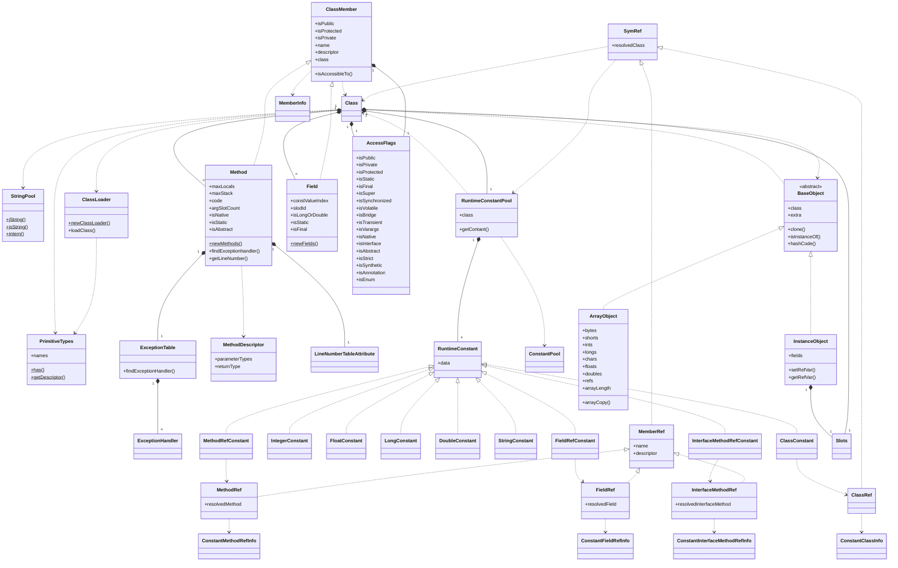

### Class

```mermaid
classDiagram
  class StringPool {
    +jString()$
    +jsString()$
    +intern()$
  }
  Class ..> StringPool

  class PrimitiveTypes {
    +names
    +has()$
    +getDescriptor()$
  }

  class ClassLoader {
    +newClassLoader()$
    +loadClass()
  }
  ClassLoader ..> PrimitiveTypes
  Class ..> PrimitiveTypes

  class ExceptionTable {
    +findExceptionHandler()
  }
  ExceptionTable "1" *-- "n" ExceptionHandler

  class MethodDescriptor {
    +parameterTypes
    +returnType
  }
  Method ..> MethodDescriptor

  class MethodRef {
    +resolvedMethod
  }
  MemberRef <|.. MethodRef
  MethodRef ..> ConstantMethodRefInfo

  class MemberRef {
    +name
    +descriptor
  }
  SymRef <|.. MemberRef

  class InterfaceMethodRef {
    +resolvedInterfaceMethod
  }
  MemberRef <|.. InterfaceMethodRef
  InterfaceMethodRef ..> ConstantInterfaceMethodRefInfo

  class FieldRef {
    +resolvedField
  }
  MemberRef <|.. FieldRef
  FieldRef ..> ConstantFieldRefInfo

  class ClassRef {
  }
  SymRef <|.. ClassRef
  ClassRef ..> ConstantClassInfo

  class SymRef {
    +resolvedClass
  }
  SymRef ..> RuntimeConstantPool
  SymRef ..> Class

  class Method {
    +newMethods()$
    +maxLocals
    +maxStack
    +code
    +argSlotCount
    +findExceptionhandler()
    +getLineNumber()
    +isNative
    +isStatic
    +isAbstract
  }
  Method "1" *-- "1" ExceptionTable
  Method "1" *-- "1" LineNumberTableAttribute

  class Field {
    +newFields()$
    +constValueIndex
    +slodId
    +isLongOrDouble
    +isStatic
    +isFinal
  }

  class ClassMember {
    +isPublic
    +isProtected
    +isPrivate
    +name
    +descriptor
    +class
    +isAccessibleTo()
  }
  ClassMember ..> MemberInfo
  ClassMember <|.. Field
  ClassMember <|.. Method
  ClassMember ..> Class
  ClassMember "1" *-- "1" AccessFlags

  class RuntimeConstant {
    +data
  }
  RuntimeConstant <|.. IntegerConstant
  RuntimeConstant <|.. FloatConstant
  RuntimeConstant <|.. LongConstant
  RuntimeConstant <|.. DoubleConstant
  RuntimeConstant <|.. StringConstant
  RuntimeConstant <|.. ClassConstant
  ClassConstant ..> ClassRef
  RuntimeConstant <|.. FieldRefConstant
  FieldRefConstant ..> FieldRef
  RuntimeConstant <|.. MethodRefConstant
  MethodRefConstant ..> MethodRef
  RuntimeConstant <|.. InterfaceMethodRefConstant
  InterfaceMethodRefConstant ..> InterfaceMethodRef

  class RuntimeConstantPool {
    +class
    +getContant()
  }
  RuntimeConstantPool ..> Class
  RuntimeConstantPool ..> ConstantPool
  RuntimeConstantPool "1" *-- "n" RuntimeConstant

  class AccessFlags {
    +isPublic
    +isPrivate
    +isProtected
    +isStatic
    +isFinal
    +isSuper
    +isSynchronized
    +isVolatile
    +isBridge
    +isTransient
    +isVarargs
    +isNative
    +isInterface
    +isAbstract
    +isStrict
    +isSynthetic
    +isAnnotation
    +isEnum
  }

  class Class {

  }
  Class "1" *-- "1" AccessFlags
  Class "1" *-- "1" RuntimeConstantPool
  Class "1" *-- "n" Field
  Class "1" *-- "n" Method
  Class ..> ClassLoader
  Class "1" *-- "1" Slots
  Class ..> BaseObject

  class ArrayObject {
    +bytes
    +shorts
    +ints
    +longs
    +chars
    +floats
    +doubles
    +refs
    +arrayLength
    +arrayCopy()
  }

  class InstanceObject {
    +fields
    +setRefVar()
    +getRefVar()
  }
  InstanceObject "1" *-- "1" Slots

  class BaseObject {
    <<abstract>>
    +clone()
    +class
    +extra
    +isInstanceOf()
    +hashCode()
  }
  BaseObject <|.. InstanceObject
  BaseObject <|.. ArrayObject
  BaseObject ..> Class
```
