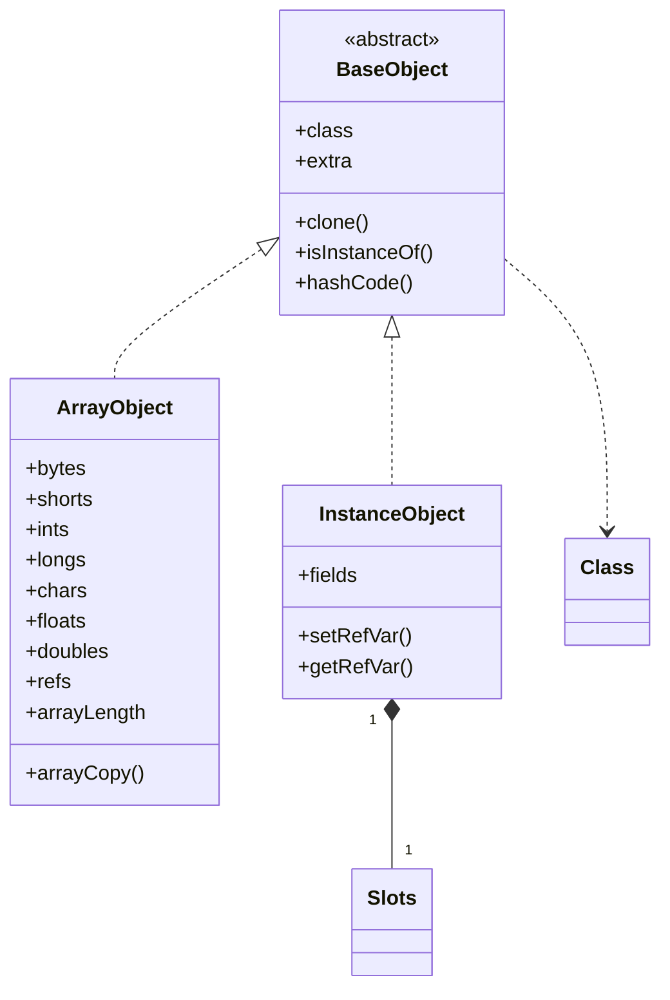

### Class

```mermaid
classDiagram
  class ArrayObject {
    +bytes
    +shorts
    +ints
    +longs
    +chars
    +floats
    +doubles
    +refs
    +arrayLength
    +arrayCopy()
  }

  class InstanceObject {
    +fields
    +setRefVar()
    +getRefVar()
  }
  InstanceObject "1" *-- "1" Slots

  class BaseObject {
    <<abstract>>
    +clone()
    +class
    +extra
    +isInstanceOf()
    +hashCode()
  }
  BaseObject <|.. InstanceObject
  BaseObject <|.. ArrayObject
  BaseObject ..> Class
```
