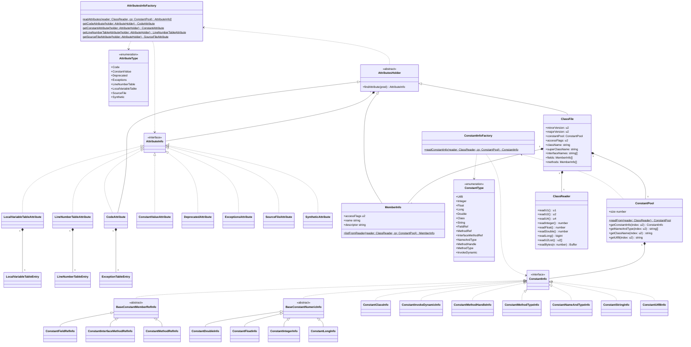

### ClassFile

```mermaid
classDiagram
  LocalVariableTableAttribute "1" *-- "n" LocalVariableTableEntry
  LineNumberTableAttribute "1" *-- "n" LineNumberTableEntry
  CodeAttribute "1" *-- "n" ExceptionTableEntry

  class AttributeType {
    <<enumeration>>
    +Code
    +ConstantValue
    +Deprecated
    +Exceptions
    +LineNumberTable
    +LocalVariableTable
    +SourceFile
    +Synthetic
  }

  class AttributesInfoFactory {
    readAttributes(reader: ClassReader, cp: ConstantPool)$ AttributeInfo[]
    getCodeAttribute(holder: AttributeHolder)$ CodeAttribute
    getConstantAttribute(holder: AttributeHolder)$ ConstantAttribute
    getLineNumberTableAttribute(holder: AttributeHolder)$ LineNumberTableAttribute
    getSourceFileAttribute(holder: AttributeHolder)$ SourceFileAttribute
  }
  AttributesInfoFactory ..> AttributeType
  AttributesInfoFactory ..> AttributeInfo
  AttributesInfoFactory <.. AttributesHolder

  class AttributeInfo {
    <<interface>>
  }
  AttributeInfo <|.. CodeAttribute
  AttributeInfo <|.. ConstantValueAttribute
  AttributeInfo <|.. DeprecatedAttribute
  AttributeInfo <|.. ExceptionsAttribute
  AttributeInfo <|.. LineNumberTableAttribute
  AttributeInfo <|.. LocalVariableTableAttribute
  AttributeInfo <|.. SourceFileAttribute
  AttributeInfo <|.. SyntheticAttribute

  class AttributesHolder {
    <<abstract>>
    +findAttribute(pred) AttributeInfo
  }
  AttributesHolder "1" *-- "n" AttributeInfo
  AttributesHolder <|-- ClassFile
  AttributesHolder <|-- MemberInfo
  AttributesHolder <|-- CodeAttribute

  class MemberInfo {
    +accessFlags u2
    +name string
    +descriptor string
    +listFromReader(reader: ClassReader, cp: ConstantPool)$ MemberInfo
  }

  class ConstantType {
    <<enumeration>>
    +Utf8
    +Integer
    +Float
    +Long
    +Double
    +Class
    +String
    +FieldRef
    +MethodRef
    +InterfaceMethodRef
    +NameAndType
    +MethodHandle
    +MethodType
    +InvokeDynamic
  }

  class ConstantInfoFactory {
    +readConstantInfo(reader: ClassReader, cp: ConstantPool)$ ConstantInfo
  }
  ConstantInfoFactory <.. ConstantPool
  ConstantInfoFactory ..> ConstantInfo
  ConstantInfoFactory ..> ConstantType

  class BaseConstantNumericInfo {
    <<abstract>>
  }
  BaseConstantNumericInfo <|-- ConstantDoubleInfo
  BaseConstantNumericInfo <|-- ConstantFloatInfo
  BaseConstantNumericInfo <|-- ConstantIntegerInfo
  BaseConstantNumericInfo <|-- ConstantLongInfo

  class BaseConstantMemberRefInfo {
    <<abstract>>
  }
  BaseConstantMemberRefInfo <|-- ConstantFieldRefInfo
  BaseConstantMemberRefInfo <|-- ConstantInterfaceMethodRefInfo
  BaseConstantMemberRefInfo <|-- ConstantMethodRefInfo

  class ConstantInfo {
    <<interface>>
  }
  ConstantInfo <|.. ConstantClassInfo
  ConstantInfo <|.. ConstantInvokeDynamicInfo
  ConstantInfo <|.. ConstantMethodHandleInfo
  ConstantInfo <|.. ConstantMethodTypeInfo
  ConstantInfo <|.. ConstantNameAndTypeInfo
  ConstantInfo <|.. ConstantStringInfo
  ConstantInfo <|.. ConstantUtf8Info
  ConstantInfo <|.. BaseConstantMemberRefInfo
  ConstantInfo <|.. BaseConstantNumericInfo

  class ConstantPool {
    +readFrom(reader: ClassReader)$ ConstantPool
    +size number
    +getConstantInfo(index: u2) ConstantInfo
    +getNameAndType(index: u2) string[]
    +getClassName(index: u2) string
    +getUtf8(index: u2) string
  }
  ConstantPool "1" *-- "n" ConstantInfo

  class ClassReader {
    +readU1() u1
    +readU2() u2
    +readU4() u4
    +readInteger() number
    +readFloat() number
    +readDouble() number
    +readLong() bigint
    +readU2List() u2[]
    +readBytes(n: number) Buffer
  }

  class ClassFile {
    +minorVersion: u2
    +majorVersion: u2
    +constantPool: ConstantPool
    +accessFlags: u2
    +className: string
    +superClassName: string
    +interfaceNames: string[]
    +fields: MemberInfo[]
    +methods: MemberInfo[]
  }
  ClassFile "1" *-- "1" ClassReader
  ClassFile "1" *-- "1" ConstantPool
  ClassFile "1" *-- "n" MemberInfo
```
