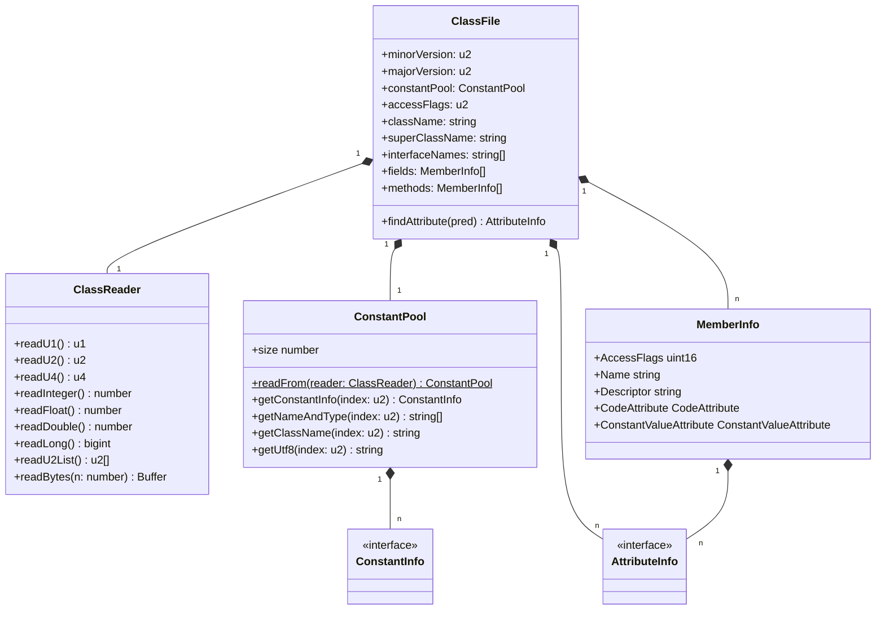

### ClassFile

```mermaid
classDiagram
  class ClassFile {
    +minorVersion: u2
    +majorVersion: u2
    +constantPool: ConstantPool
    +accessFlags: u2
    +className: string
    +superClassName: string
    +interfaceNames: string[]
    +fields: MemberInfo[]
    +methods: MemberInfo[]
    +findAttribute(pred) AttributeInfo
  }
  ClassFile "1" *-- "1" ClassReader
  ClassFile "1" *-- "1" ConstantPool
  ClassFile "1" *-- "n" MemberInfo
  ClassFile "1" *-- "n" AttributeInfo

  class ClassReader {
    +readU1() u1
    +readU2() u2
    +readU4() u4
    +readInteger() number
    +readFloat() number
    +readDouble() number
    +readLong() bigint
    +readU2List() u2[]
    +readBytes(n: number) Buffer
  }

  class ConstantPool {
    +readFrom(reader: ClassReader)$ ConstantPool
    +size number
    +getConstantInfo(index: u2) ConstantInfo
    +getNameAndType(index: u2) string[]
    +getClassName(index: u2) string
    +getUtf8(index: u2) string
  }
  ConstantPool "1" *-- "n" ConstantInfo

  class ConstantInfo
  <<interface>> ConstantInfo

  class MemberInfo {
    +AccessFlags uint16
    +Name string
    +Descriptor string
    +CodeAttribute CodeAttribute
    +ConstantValueAttribute ConstantValueAttribute
  }
  MemberInfo "1" *-- "n" AttributeInfo

  class AttributeInfo
  <<interface>> AttributeInfo
```
