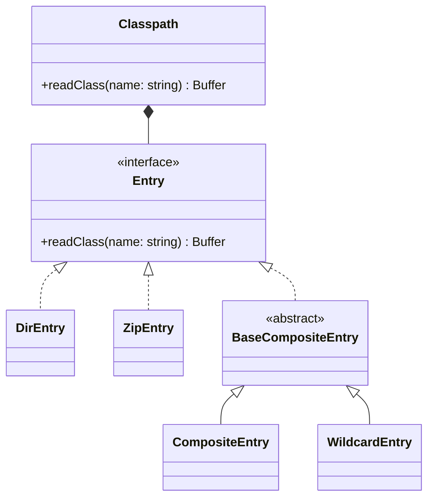

### Classpath

```mermaid
classDiagram
  class Classpath {
    +readClass(name: string) Buffer
  }
  Classpath *-- Entry

  class Entry {
    <<interface>>
    +readClass(name: string) Buffer
  }

  class DirEntry
  Entry <|.. DirEntry

  class ZipEntry
  Entry <|.. ZipEntry

  class BaseCompositeEntry {
    <<abstract>>
  }
  Entry <|.. BaseCompositeEntry

  class CompositeEntry
  BaseCompositeEntry <|-- CompositeEntry

  class WildcardEntry
  BaseCompositeEntry <|-- WildcardEntry
```
