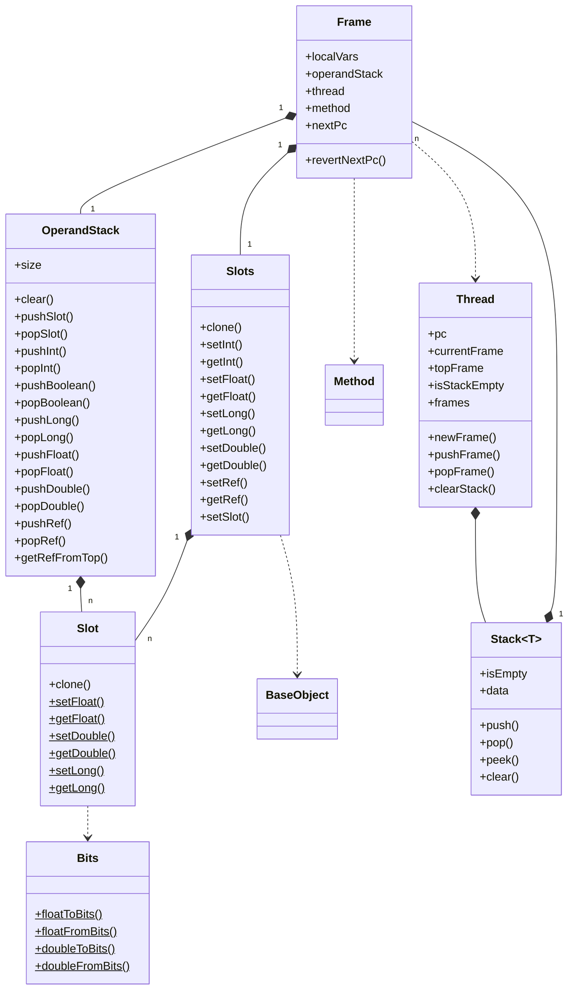

### Thread

```mermaid
classDiagram
  class OperandStack {
    +clear()
    +size
    +pushSlot()
    +popSlot()
    +pushInt()
    +popInt()
    +pushBoolean()
    +popBoolean()
    +pushLong()
    +popLong()
    +pushFloat()
    +popFloat()
    +pushDouble()
    +popDouble()
    +pushRef()
    +popRef()
    +getRefFromTop()
  }
  OperandStack "1" *-- "n" Slot

  class Bits {
    +floatToBits()$
    +floatFromBits()$
    +doubleToBits()$
    +doubleFromBits()$
  }

  class Slot {
    +clone()
    +setFloat()$
    +getFloat()$
    +setDouble()$
    +getDouble()$
    +setLong()$
    +getLong()$
  }
  Slot ..> Bits

  class Slots {
    +clone()
    +setInt()
    +getInt()
    +setFloat()
    +getFloat()
    +setLong()
    +getLong()
    +setDouble()
    +getDouble()
    +setRef()
    +getRef()
    +setSlot()
  }
  Slots "1" *-- "n" Slot
  Slots ..> BaseObject

  class Frame {
    +localVars
    +operandStack
    +thread
    +method
    +nextPc
    +revertNextPc()
  }
  Frame "1" *-- "1" Slots
  Frame "1" *-- "1" OperandStack
  Frame ..> Method
  Frame ..> Thread

  class Stack~T~ {
    +isEmpty
    +data
    +push()
    +pop()
    +peek()
    +clear()
  }

  class Thread {
    +pc
    +currentFrame
    +topFrame
    +isStackEmpty
    +frames
    +newFrame()
    +pushFrame()
    +popFrame()
    +clearStack()
  }
  Thread *-- Stack
  Stack "1" *-- "n" Frame
```
